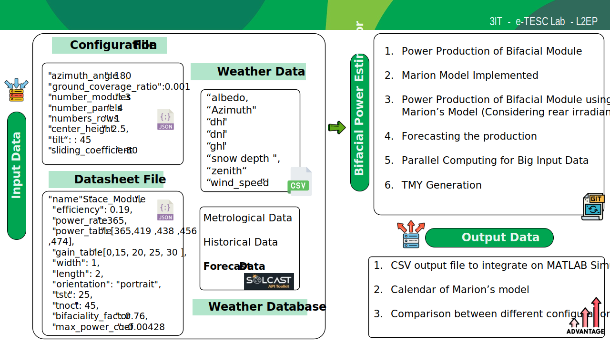
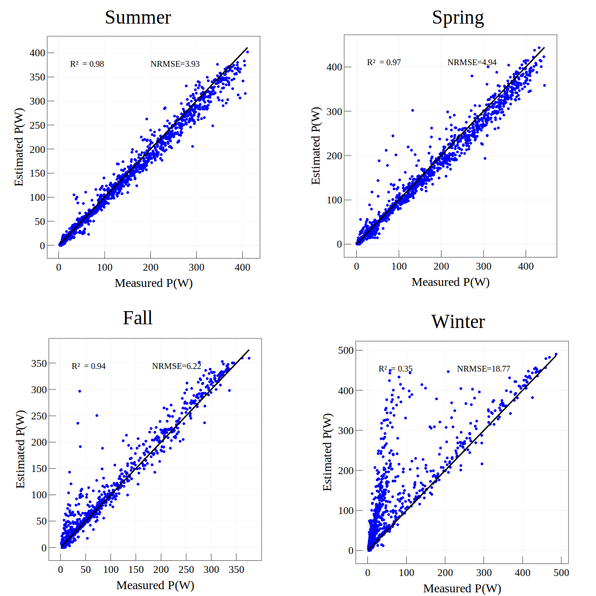

# Bifacial Power Estimator

## Project Overview

This project aims to estimate the power production of bifacial solar modules using the view factor technique. It focuses particularly on varying climate conditions, including snow coverage, which can significantly impact the power output of bifacial modules. The project includes utilities such as the typical meteorological year (TMY) data and power forecasting tools.

## Key Features

**View Factor Technique**: Employs the view factor method to accurately estimate power production from bifacial modules.  
**Climate Adaptability**: Considers different climate conditions, with a special focus on scenarios involving snow coverage.  
**Meteorological Data Integration**: Novel approach to generate the TMY(Typical Meteorological Year) using principal component Analysis.  
**Power Forecasting**: Using the forecasted meteorological data from Solcast this tool can be used to accurately forecast the power production of bifacial modules.  

## Flowchart



- Validation of the model using the installed system at the UdeS campus:  
<p align = 'center'>

</p>

## How To Install and Run this Project 


- Ensure you have Python and `pip` installed. You can download Python from [python.org](https://www.python.org/) and `pip` usually comes with it.

### Clone the Repository

- First, clone the repository to your local machine:
```sh
git clone  https://github.com/SoufianeGG/BifacialPowerEstimator.git 
```
- Navigate to the Project Library 
```sh
cd BifacialPowerEstimator
```

- Create the virtual environement : 
```sh 
python -m venv venv
```
- Activate the virtual environement (Windows):
```sh
.\venv\Scripts\activate
```
(MAC): 

```sh
source venv/bin/activate
```

- Install the package along with its dependencies (recommended) : 
```sh
pip install .
```
- Or Install all the Dependencies : 

```sh
pip install -r requirements.txt  
```


## Documentation 

For a detailed example of power estimation, please refer to the tutorials directory. Inside, you will find comprehensive tutorials on power estimation under snowy conditions and TMY (Typical Meteorological Year) generation.